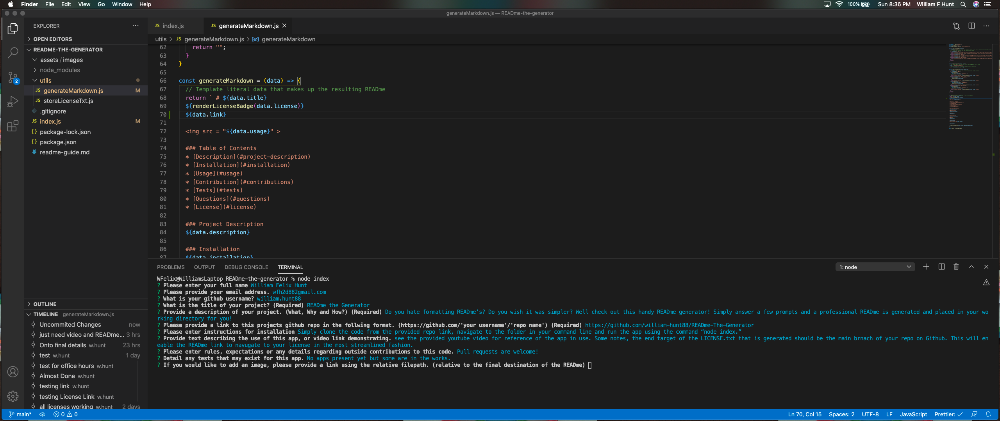

 # READme the Generator
   

  
  
  ### Table of Contents
  * [Description](#project-description)
  * [Installation](#installation)
  * [Usage](#usage)
  * [Contribution](#contributions)
  * [Tests](#tests)
  * [Questions](#questions)
  * [License](#license)
  
  ### Project Description
  Do you hate formatting READme’s? Do you wish it was simpler? Well check out this handy READme generator! Simply answer a few prompts and a professional READme is generated and placed in your working directory for you!

  ### Installation
  Simply clone the code from the provided repo link, navigate to the folder in your command line and run the app using the command “node index.” 

  ### Usage
  

  ### Contributions
  Pull requests are welcome!

  ### Tests
  No tests yet but thats next!

  ### Questions
  wfh2d88@gmail.com   

  https://github.com/william.hunt88

  https://github.com/william-hunt88/READme-The-Generator
  
  
  Licensed under the [MIT](https://github.com/william-hunt88/READme-The-Generator/blob/main/LICENSE.txt) license
